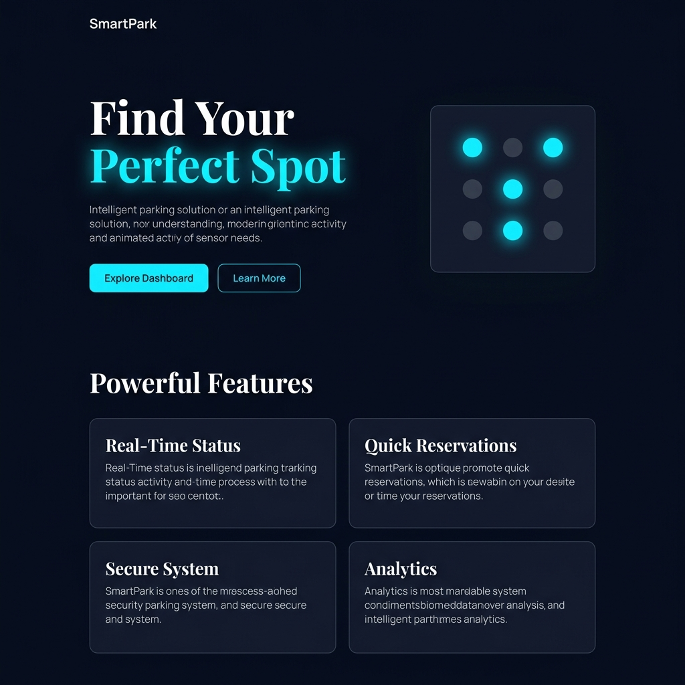
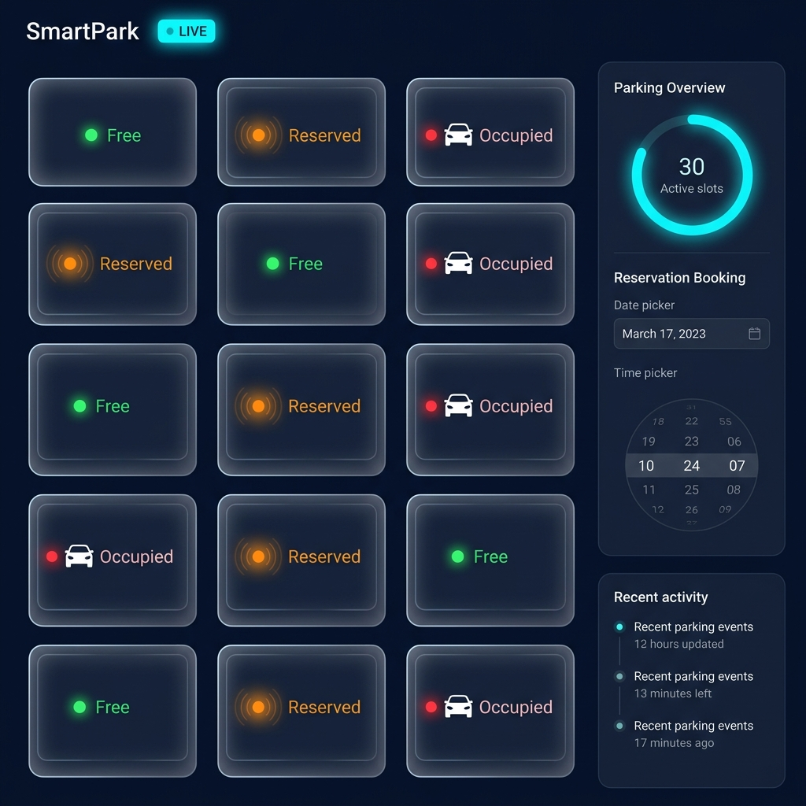
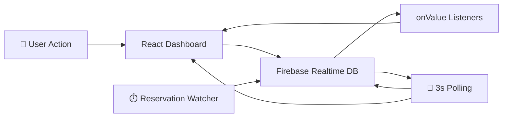

<div align="center">

# 🅿️ SmartPark

### *Intelligent Parking Management — Reimagined*

[](https://react.dev/)
[](https://www.typescriptlang.org/)
[](https://firebase.google.com/)
[](https://vitejs.dev/)
[](https://tailwindcss.com/)

<br/>

> A real-time IoT parking management dashboard with live slot monitoring, seamless reservations, and an animated sensor-driven interface — all powered by Firebase.

<br/>



</div>

---

## ✨ Features

<table>
<tr>
<td width="50%">

### 🔴🟢🟠 Live Slot Monitoring
Real-time parking slot status with animated car vectors, glowing status indicators, and smooth state transitions. Slots update instantly via Firebase listeners.

### 📅 Smart Reservation System
Book parking slots with a **custom calendar date picker** and innovative **24-hour drum-wheel time picker**. Built-in past-time validation prevents invalid bookings.

### ⏱️ Auto-Expiry Engine
A background reservation watcher (`useReservationWatcher`) automatically detects and clears expired reservations every 3 seconds — even when the dashboard tab isn't open.

</td>
<td width="50%">

### 📊 Parking Overview Dashboard
Circular progress ring visualizing occupancy, with real-time counters for Free, Reserved, and Occupied slots. System health percentage adapts to connectivity.

### 🌡️ Environmental Monitoring
Temperature and humidity cards with Material Design icons providing at-a-glance environmental data for the parking zone.

### 📜 Activity Logging
Timestamped event log tracking every park-in, park-out, reservation, and expiry event — sortable and scrollable with a custom-styled scrollbar.

</td>
</tr>
</table>

---

## 🖼️ Screenshots

<div align="center">

| Landing Page | Dashboard |
|:---:|:---:|
|  |  |

</div>

---

## 🏗️ Architecture

```
SmartPark/
├── src/
│   ├── App.tsx                  # Router + global reservation watcher
│   ├── firebase.ts              # Firebase config (env-based)
│   ├── main.tsx                 # React entry point
│   ├── pages/
│   │   ├── Landing.tsx          # Animated landing page with dot-grid
│   │   └── Dashboard.tsx        # Real-time parking dashboard
│   ├── hooks/
│   │   └── useReservationWatcher.ts  # Background expiry engine
│   └── assets/                  # Static images & SVGs
├── index.html                   # App shell with Google Fonts
├── tailwind.config.js           # Material 3 color tokens
├── vite.config.ts               # Vite configuration
└── .env                         # Firebase credentials (gitignored)
```

### Data Flow



---

## 🛠️ Tech Stack

| Layer | Technology |
|-------|-----------|
| **Frontend** | React 19 + TypeScript 6.0 |
| **Bundler** | Vite 8.0 (HMR + ESBuild) |
| **Styling** | TailwindCSS 3.4 + Material 3 Design Tokens |
| **Backend** | Firebase Realtime Database |
| **Icons** | Material Symbols + Lucide React |
| **Fonts** | Playfair Display · Manrope · Space Grotesk |
| **Routing** | React Router DOM v7 |

---

## 🚀 Getting Started

### Prerequisites

- **Node.js** ≥ 18.x
- **npm** ≥ 9.x
- A [Firebase project](https://console.firebase.google.com/) with Realtime Database enabled

### 1. Clone the Repository

```bash
git clone https://github.com/your-username/SmartPark.git
cd SmartPark
```

### 2. Install Dependencies

```bash
npm install
```

### 3. Configure Firebase

Create a `.env` file in the project root with your Firebase credentials:

```env
VITE_FIREBASE_API_KEY=your_api_key
VITE_FIREBASE_AUTH_DOMAIN=your_project.firebaseapp.com
VITE_FIREBASE_PROJECT_ID=your_project_id
VITE_FIREBASE_STORAGE_BUCKET=your_project.firebasestorage.app
VITE_FIREBASE_MESSAGING_SENDER_ID=your_sender_id
VITE_FIREBASE_APP_ID=your_app_id
VITE_FIREBASE_MEASUREMENT_ID=your_measurement_id
```

### 4. Set Up Firebase Database

Your Firebase Realtime Database should have the following structure:

```json
{
  "slots": {
    "A1": { "status": "free", "isReserved": false, "isActive": true },
    "A2": { "status": "free", "isReserved": false, "isActive": true },
    "A3": { "status": "free", "isReserved": false, "isActive": true },
    "A4": { "status": "free", "isReserved": false, "isActive": true },
    "A5": { "status": "free", "isReserved": false, "isActive": true }
  },
  "system": {
    "isOnline": true,
    "lastUpdated": 0
  },
  "logs": {}
}
```

### 5. Launch Development Server

```bash
npm run dev
```

The app will be available at `http://localhost:5173`

---

## 📦 Build for Production

```bash
npm run build
```

The optimized output will be in the `dist/` directory, ready for deployment to Firebase Hosting, Vercel, Netlify, or any static host.

---

## 🎨 Design System

SmartPark uses a **Material 3-inspired dark theme** with custom design tokens:

| Token | Value | Usage |
|-------|-------|-------|
| `--color-background` | `#0b1326` | Deep navy base |
| `--color-primary-container` | `#00e5ff` | Cyan accent / CTAs |
| `--color-error` | `#ffb4ab` | Occupied / alerts |
| `--color-on-surface` | `#dae2fd` | Primary text |
| `--color-surface-container` | `#171f33` | Card backgrounds |

Key design elements:
- **Glassmorphism** panels with backdrop blur
- **Neon pulse** glowing effects on live indicators
- **Smooth CSS transitions** on all state changes (700ms cubic-bezier)
- **Custom scrollbars** with themed track/thumb colors

---

## 🔑 Key Components

### `useReservationWatcher` Hook
A global background process that runs at the App level. Every 3 seconds it reads slots directly from Firebase, detects expired reservations, clears them atomically, and logs each expiry event.

### Custom Time Picker
A 24-hour **drum-wheel time picker** with:
- Mouse scroll support for quick selection
- Quick-add chips (+15m, +30m, +1h, +2h)
- Time-of-day color coding (🌙 night → 🌅 morning → ☀️ afternoon → 🌆 evening)
- 5-minute interval precision

### Custom Date Picker
An inline **calendar picker** with:
- Month/year navigation
- Past-date disabling
- Today highlighting
- Smooth dropdown animation

---

## 🤝 Contributing

Contributions are welcome! Please follow these steps:

1. **Fork** the repository
2. Create a **feature branch** (`git checkout -b feature/amazing-feature`)
3. **Commit** your changes (`git commit -m 'Add amazing feature'`)
4. **Push** to the branch (`git push origin feature/amazing-feature`)
5. Open a **Pull Request**

---

## 📝 License

This project is open source and available under the [MIT License](LICENSE).

---

<div align="center">

**Built with 💙 using React, Firebase & a passion for smart cities**

<br/>


</div>
